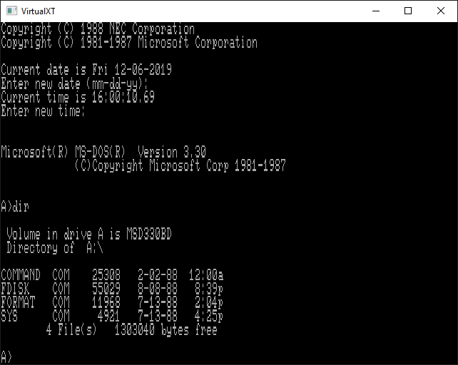

# VirtualXT

```
THIS EMULATOR IS WORK-IN-PROGRESS!

At this point you need a video BIOS image from an alternative source.
(https://github.com/BaRRaKudaRain/PCem-ROMs)

One image that is known to work is the ATI EGA Wonder 800+ but most EGA/VGA ones should do the trick.
```

VirtualXT is a IBM PC/XT emulator that runs on modern hardware and operating systems.
It is designed to be simple and lightweight yet still capable enough to run a large
library of old application and games.

### Build

The emulator is written i pure Go and should compile with only the standard
Go [toolchain](https://golang.org/dl/) installed. Although in that case you are limited to textmode only.
If you want graphics and sound you need to link with the SDL2 library by passing the build tag ```sdl```.

### Screenshots



