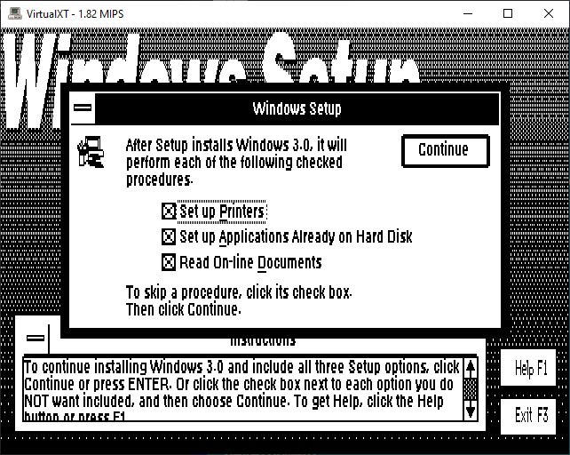

# VirtualXT

[](https://github.com/andreas-jonsson/virtualxt/actions/workflows/ci.yml)
[](https://codecov.io/gh/andreas-jonsson/virtualxt)
[](https://github.com/andreas-jonsson/virtualxt/discussions)
[](https://issuehunt.io/r/andreas-jonsson/virtualxt)

VirtualXT is a IBM PC/XT (8088/V20) emulator that runs on modern hardware and operating systems.
It is designed to be simple and lightweight yet still capable enough to run a large
library of old application and games.

## Features

* Intel 8088 or NEC V20 CPU
* 1MB RAM
* CGA/HGC compatible graphics
* Turbo XT BIOS 3.1 + VXTX
* Keyboard controller with 83-key XT-style keyboard
* Serial port with Microsoft 2-button mouse
* Floppy and hard disk controller
* Ethernet adapter
* PC speaker

## Build

The emulator is implemented in Go and should compile with only the standard Go [toolchain](https://golang.org/dl/) installed. Although in that case you are limited to textmode only.
If you want graphics and sound you need to link with the SDL2 library by passing the build tag ```sdl```.

```
git clone https://github.com/andreas-jonsson/virtualxt.git
cd virtualxt
go build -tags sdl
```

You can download pre-built binaries from [itch.io](https://phix.itch.io/virtualxt/purchase). OSX and Linux users can also download VirtualXT using [Homebrew](https://brew.sh).

```
brew tap andreas-jonsson/virtualxt
brew install virtualxt
```

## Screenshots





