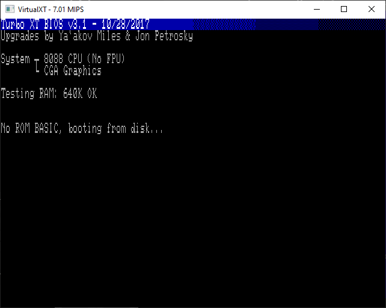
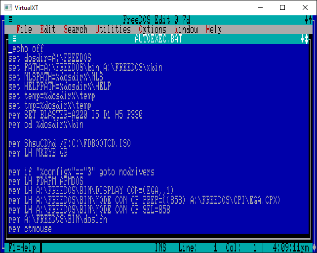

# VirtualXT

[](https://github.com/andreas-jonsson/virtualxt/actions/workflows/sdl2.yml)
[](https://codecov.io/gh/andreas-jonsson/virtualxt)
[](https://phix.itch.io/virtualxt/community)
[](https://issuehunt.io/r/andreas-jonsson/virtualxt)

VirtualXT is a IBM PC/XT (8088/V20) emulator that runs on modern hardware and operating systems.
It is designed to be simple and lightweight yet still capable enough to run a large
library of old application and games.

Browser version is avalible [here](https://realmode.games).

## Features

* Intel 8088 or NEC V20 CPU
* Hardware CPU validator
* CGA/HGC compatible graphics
* Turbo XT BIOS 3.1 with extensions
* Keyboard controller with 83-key XT-style keyboard
* Serial port with Microsoft 2-button mouse
* Floppy and hard disk controller
* Direct file share with host
* Flexible module system
* AdLib music synthesizer
* EMS memory expansion
* Ethernet adapter
* Real Time Clock
* PC speaker

## Screenshots







## Build

The emulator is written in C11 and can be compiled with most modern C compilers. In order to generate a Makefile you need to install [Premake](https://premake.github.io/). You also need to have [SDL2](https://www.libsdl.org/) installed on your system or pass `--sdl-path=<path to lib>` to the premake script.

```
git clone https://github.com/andreas-jonsson/virtualxt.git
cd virtualxt
premake5 gmake
make sdl2-frontend
```

You can download pre-built binaries from [itch.io](https://phix.itch.io/virtualxt/purchase).

If you want to embed the emulator or create a custom frontend you can find libvxt API documentation [here](https://andreas-jonsson.github.io/virtualxt/docs).

## Validation

A hardware validator was developed to ensure proper CPU behaviour.
Some additional information about that can be found [here](https://hackaday.io/project/184209-virtualxt-hardware-validator).


