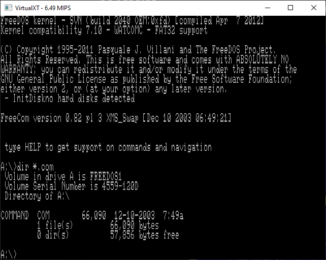
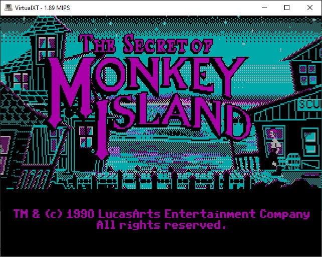
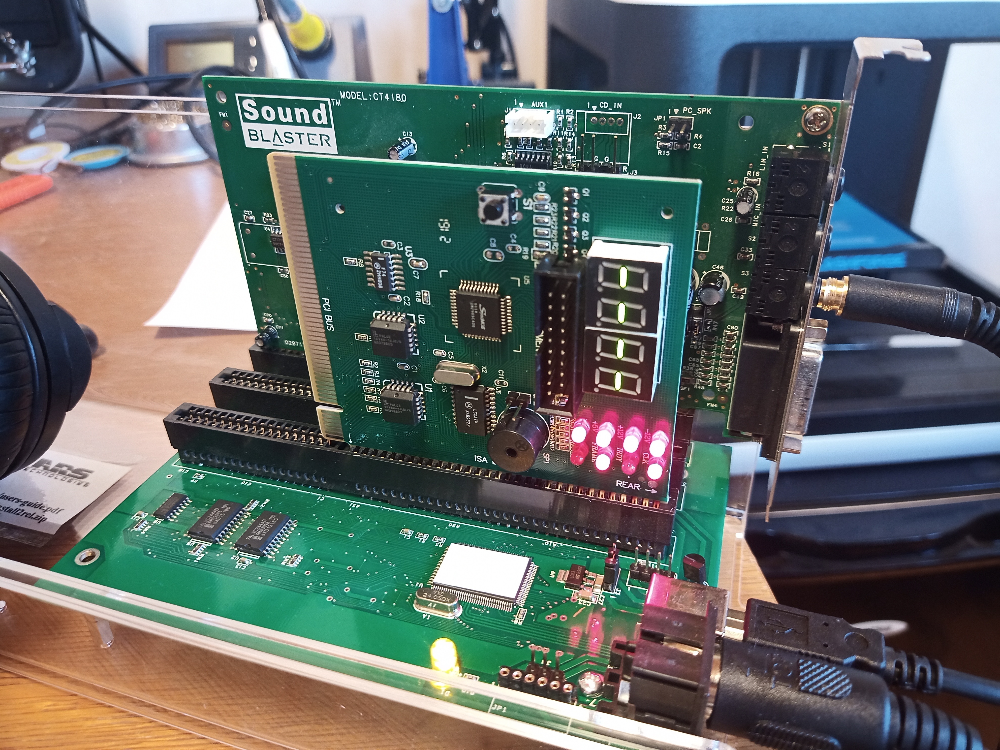
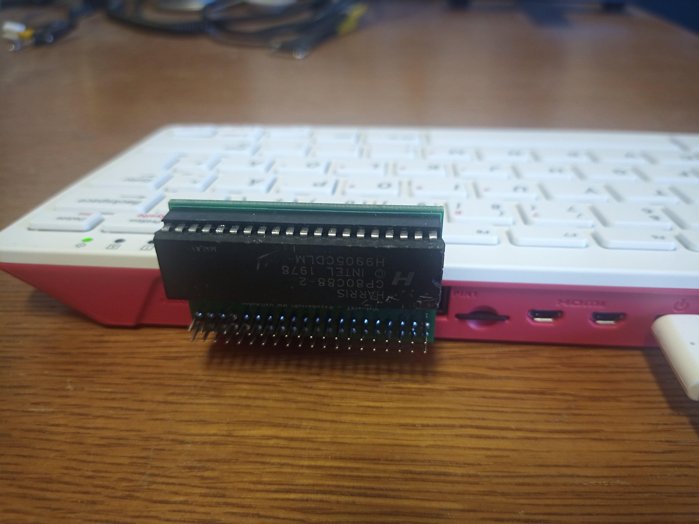

# VirtualXT

[](https://github.com/andreas-jonsson/virtualxt/actions/workflows/sdl2.yml)
[](https://codecov.io/gh/andreas-jonsson/virtualxt)
[](https://repology.org/project/virtualxt/versions)
[](https://matrix.to/#/#virtualxt:matrix.org)
[](https://issuehunt.io/r/andreas-jonsson/virtualxt)

VirtualXT is a Turbo PC/XT emulator that runs on modern hardware and operating systems.
It is designed to be simple and lightweight yet still capable enough to run a large
library of old application and games.

Browser version is avalible [here](https://realmode.games).

## Features

* Intel 286 processor
* PC/XT chipset
* Hardware CPU validator
* CGA or VGA compatible graphics
* GLaBIOS or Turbo XT BIOS 3.1 with extensions
* Keyboard controller with 83-key XT-style keyboard
* Serial port with Microsoft 2-button mouse
* Floppy and hard disk emulation
* ISA passthrough​using Arstech USB2ISA adapter
* Direct file share with host
* Flexible module system
* Integerated GDB server
* AdLib music synthesizer
* EMS memory expansion
* Ethernet adapter
* and more...

## Screenshots






## Build

The emulator is written in C11 and can be compiled with most modern C compilers. In order to generate a Makefile you need to install [Premake](https://premake.github.io/). You also need to have [SDL2](https://www.libsdl.org/) installed on your system or pass `--sdl-path=<path to lib>` to the premake script.

```
git clone -b release https://github.com/andreas-jonsson/virtualxt.git
cd virtualxt
premake5 --modules gmake
make sdl2-frontend
```

You can download pre-built binaries from [itch.io](https://phix.itch.io/virtualxt/purchase).

If you want to embed the emulator or create a custom frontend you can find libvxt API documentation [here](https://andreas-jonsson.github.io/virtualxt/docs).

## ISA Passthrough​

VirtualXT supports ISA passthrough using Arstech [USB2ISA](https://arstech.com/install/ecom-catshow/usb2.0.html) adapter or the [CH367](https://www.aliexpress.com/item/1005003569540792.html) development board.
It should be noted that DMA currently not supported and the CH367 board is **VERY** limited in it's capabilities.



## Hardware Validation

A hardware validator was developed to ensure proper CPU behaviour.
Some additional information about that can be found [here](https://hackaday.io/project/184209-virtualxt-hardware-validator).
This [talk](https://youtu.be/qatzd0niz9A?si=_NVqQu_zc1KDB8W6) by Daniel Balsom describes the process in details.



## Shout-out

Friends, contributors and sources of inspiration!

* **gloriouscow**
* **homebrew8088**
* **fmahnke**
* **adriancable**
* **mikechambers84**
* **trylle**
* **640-KB**
